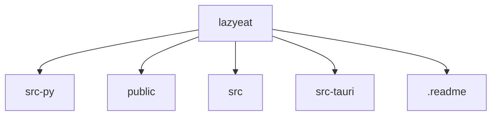

# 基础信息

|      |      |
|------|------|
| 名称 | lazyeat |
| 编码语言 | .java |
| 代码路径 | lazyeat |
| 概述说明 | None |

# 说明

None

### 包内部结构视图

该流程图展示了`lazyeat`项目的目录结构。`lazyeat`作为根目录，包含五个子目录或文件：`src-py`、`public`、`src`、`src-tauri`和`.readme`。这些子目录或文件分别代表了项目中的不同模块或资源，结构清晰，便于开发和管理。

# 文件列表 File List

| 名称   | 类型  | 说明 |
|-------|------|-------------|

